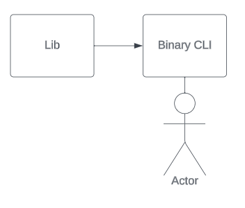
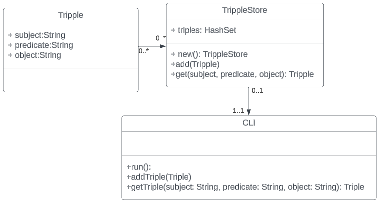

# A CLI SPARQL RDF Example
This project should hopefully highlight my ability to work in Rust 
and turn around a project in an unfamiliar time in a relatively short amount of time.

## Goals
 [x] Set up mock triple-store DB to house RDF data
 
 [x] Provide utility to upload RDF data
 
 [ ] provide CLI for making SPARQL commands
 
 [ ] display Query results in a legible format.

---

## Starting Architecture
This project will container a lib for a reusable codebase, 
as well as a binary to hold the CLI and provide a working example.

### Base Architecture

The User will interact with the Binary, which will use the lib to interact with the triple-store.

#### UML

 

## Setup and Environment
TODO
